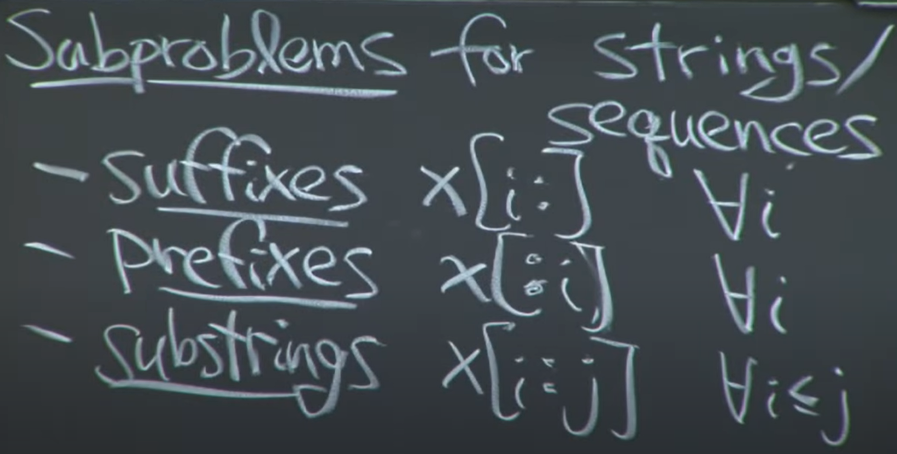

## Remember Normal Framework of Algorithm

#### methodology
* 无序 -> 排序 -> 二分
  * 二元排序问题，先定一元，另一元用单调栈实现排序
* 最近最大/最小 -> 单调栈(存储元素下标可以计算元素距离)
  * 连续数组阶梯面积
  * 二元右侧最大
* 连续数组和 -> 前后缀和
* 区间操作 -> 树桩数组 -> 线段树(区间查询，区间更新，单点更新)
* 质因数分解与统计 -> 欧拉筛(线性筛)

#### 易错点
* 数组翻转却不对应
```python
for i, item in enumerate(arr[::-1]):
    arr[i] # 很明显数组翻转了，但是索引没反转
```

#### 1. Recursive
* Backtrack __(DFS)__
    * Demo:
     ```python
        class Solution:
            def permuteUnique(self, nums: List[int]) -> List[List[int]]:
                res=[]
                def dfs(nums,path):
                    if not nums:
                        res.append(path)
                    else:
                        last='' # use last to remember variable just selected
                        for i in range(len(nums)):
                            if not nums[i]==last: # skip the variable just selected
                                dfs(nums[:i]+nums[i+1:],path+[nums[i]])
                                last=nums[i]

                dfs(sorted(nums),[]) # Deduplication, sorted()
                return res
     ```
    * Scenarios:
        * Problems related to path
        * __Enumeration__
    * Features:
        * __set enumeration__

#### 2. Dynamic Programming
* __Condition__:
    * Optimal substructure
    * Overlapping sub-problems
* __Implementation__:
    * This can be achieved in either of two ways:
        * __*Top-down approach*__: This is the direct fall-out of the recursive formulation of any problem. If the solution to any problem can be formulated recursively using the solution to its sub-problems, and if its sub-problems are overlapping, then one can easily memoize or store the solutions to the sub-problems in a table. Whenever we attempt to solve a new sub-problem, we first check the table to see if it is already solved. If a solution has been recorded, we can use it directly, otherwise we solve the sub-problem and add its solution to the table.
        * __*Bottom-up approach*__: Once we formulate the solution to a problem recursively as in terms of its sub-problems, we can try reformulating the problem in a bottom-up fashion: try solving the sub-problems first and use their solutions to build-on and arrive at solutions to bigger sub-problems. This is also usually done in a tabular form by iteratively generating solutions to bigger and bigger sub-problems by using the solutions to small sub-problems. For example, if we already know the values of F41 and F40, we can directly calculate the value of F42.
    
* The __*core*__ of dynamic programming: __*recursive formulas (i.e. the transfer of state equations), then fill in the state table*__
    * Therefore, you must know exactly what the state means in the equation, e.g. the meaning of $(i,j)$
    * Dimensionality reduction
* Differences from "divide and conquer":
    * There are two key attributes that a problem must have in order for dynamic programming to be applicable: optimal substructure and overlapping sub-problems. If a problem can be solved by combining optimal solutions to non-overlapping sub-problems, the strategy is called "divide and conquer" instead.[1] This is why merge sort and quick sort are not classified as dynamic programming problems
* __Procedure__:
    1. Determine the state
        * Accurately identify each state and make sense
            * e.g. the share problem
            ```python
            for 状态1 in 状态1的所有取值：
                for 状态2 in 状态2的所有取值：
                    for ...
                        dp[状态1][状态2][...] = 择优(选择1，选择2...)
            
            每天都有三种「选择」：买入、卖出、无操作，我们用 buy, sell, rest 表示这三种选择。但问题是，并不是每天都可以任意选择这三种选择的，因为 sell 必须在 buy 之后，buy 必须在 sell 之后。那么 rest 操作还应该分两种状态，一种是 buy 之后的 rest（持有了股票），一种是 sell 之后的 rest（没有持有股票）。而且别忘了，我们还有交易次数 k 的限制，就是说你 buy 还只能在 k > 0 的前提下操作

        
            dp[i][k][0] = max(dp[i-1][k][0], dp[i-1][k][1] + prices[i])
                          max(   选择 rest  ,           选择 sell      )

            解释：今天我没有持有股票，有两种可能：
            要么是我昨天就没有持有，然后今天选择 rest，所以我今天还是没有持有；
            要么是我昨天持有股票，但是今天我 sell 了，所以我今天没有持有股票了。

            dp[i][k][1] = max(dp[i-1][k][1], dp[i-1][k-1][0] - prices[i])
                          max(   选择 rest  ,           选择 buy         )

            解释：今天我持有着股票，有两种可能：
            要么我昨天就持有着股票，然后今天选择 rest，所以我今天还持有着股票；
            要么我昨天本没有持有，但今天我选择 buy，所以今天我就持有股票了。

            作者：labuladong
            链接：https://leetcode-cn.com/problems/best-time-to-buy-and-sell-stock-iv/solution/yi-ge-tong-yong-fang-fa-tuan-mie-6-dao-gu-piao-w-5/
            来源：力扣（LeetCode）
            著作权归作者所有。商业转载请联系作者获得授权，非商业转载请注明出处。
            ```
        * Always pay attention to the __factors__, which are usually the dimension of the array(table) and come from condition
        * The last step (optimal coin combination:(2,5,7)->27, $a_k$)
        * Translate into subproblems (27-$a_k$)
        * Note the state collision

    2. __State transition equation__
        * __It is the process of breaking a big problem into sub-problems__
        * __The essence is to avoid calculating the value of overlapping sub-problems, which occurs in conventional recursive solving methods. The strategy is to record the value of overlapping sub-problems.__
        * __$F[x]=min\{F[x-2]+1,F[x-5]+1,F[x-7]+1\}$__
        * __$f(x)=min\{f(x-2)+1,f(x-5)+1,f(x-7)+1\}$__
        * __$x$ acutually is the parameter of the function $f$__.
        * __Hence, $dp[a][b]$ can be regarded as the function $f(a,b)$__
    3. Initial condition and the boundary condition
        * $F[0]=0, the\;F[y]=+INF$ if it cannot be combined by $y$
        * Note that initialization (i.e. the way to fill in the table) depends on the state transition equation
            * For example, check whether a string is palindrome
            ```java
                boolean[][] dp = new boolean[s.length()][s.length()];
                int length = s.length();
                //考虑所有长度的子串
                for (int len = 1; len <= length; len++) {
                    //从每个下标开始
                    for (int i = 0; i <= s.length() - len; i++) {
                        int j = i + len - 1; // i and j change synchronously
                        dp[i][j] = s.charAt(i) == s.charAt(j) && (len < 3 || dp[i + 1][j - 1]);
                    }
                }

                作者：windliang
                链接：https://leetcode-cn.com/problems/palindrome-partitioning/solution/xiang-xi-tong-su-de-si-lu-fen-xi-duo-jie-fa-by-3-7/
                来源：力扣（LeetCode）
                著作权归作者所有。商业转载请联系作者获得授权，非商业转载请注明出处。
            ```
            
            
            * <a href='https://leetcode-cn.com/problems/palindromic-substrings/'>#647.Palindromic Substrings</a>
                * 注意f[i][j]指s[i...j]字符串
                * 区间求法：1.区间长度[2,len(s)]; 2.i的范围[),**先看$j=i+le-1$(eg: le=2,i=1,j=2), 然后再求i的范围即 j=i+le-1<len(s)**, 从而i<len(s)-le+1, 因为在python里面是左闭右开，所以是[0,len(s)-le+1) 
            ```python
            # python version
            class Solution:
                def countSubstrings(self, s: str) -> int:
                    N=len(s)
                    f=[[False for _ in range(N)] for _ in range(N)]
                    ans=0
                    for i in range(N):
                        f[i][i]=True
                        ans+=1
                    for le in range(2,N+1):#[]
                        for i in range(len(s)-le+1):
                            j=i+le-1 #i+le<len(s)=>i<len(s)-le
                            if le==2 and s[i]==s[j]:
                                f[i][j]=True
                                ans+=1
                                continue
                            if s[i]==s[j]:
                                f[i][j]=f[i+1][j-1]
                                if f[i][j]:ans+=1
                            else:
                                f[i][j]=False
                    return ans

            ```

        * <a href='https://ac.nowcoder.com/acm/problem/24382'>W学长的零花钱</a>

    4. The calculation order:
        * $F[0], F[1], F[2]...$
    * 5 easy steps:
        
* __Scenarios__
    * optimal value
    * count problem
    * exist or not

* __Classical Problems__
    * sub sequenece problems
        
    * knapsack
    * edit distances
    * LIS:
        * **最长子序列的问题**
            * 最普通的解法：枚举所有子序列$O(n!)$时间复杂度
            * 转化为枚举所有序列元素：必然存在最长子序列以序列某一元素结尾，且序列最长，从而求的所有已序列元素为结尾的最长子序列，最后求最大值即可


* __Types__:
    * __Digit DP__
        * <a href='https://blog.csdn.net/wust_zzwh/article/details/52100392?depth_1-utm_source=distribute.pc_relevant.none-task-blog-OPENSEARCH-3&utm_source=distribute.pc_relevant.none-task-blog-OPENSEARCH-3'>csdn blog</a>
        * <a href="https://www.bilibili.com/video/BV1Fc411h76q?from=search&seid=8872914714857826356">Video tutorial</a>
    * __Probability DP__
    * __Interval DP__
        * The reason for enumerating intervals is to ensure that the used state has been calculated before.

    
* __Summary__:
    * Note the form of the equation when two or more objects are involved, where the equation must contain pointers that can represent each object individually
    * Most recursion can be rewritten with the idea of dynamic programming
* __References__:
    * https://en.wikipedia.org/wiki/Dynamic_programming


#### 3. The theory of Graph

* __BFS__

* __DFS__
    


#### 4. Search
* Binary search:
    * 特征:
        * 划重点，一般题目中出现最近最远，最小最大，求最大化最小值、最小化最大值，应该就是在考察二分/三分了。<a href='https://leetcode-cn.com/problems/magnetic-force-between-two-balls/solution/er-fen-gao-qi-by-time-limit/'>#5489. 两球之间的磁力</a>

#### 5. Iteration
* The main idea:
  * step 1: determine the procedure of the algorithm, for example, loop, recursive, dynamic programming
  * step 2: determine what to do at each step
  * step 3: especially pay attention to the boundary conditions

#### 6. Number Theory
* __The prime numbers__:
    * Euler sieve: $T:O(n)$
        ```C++
        int countPrimes(n){
            int i,j,countnum=1;
            int prime[MAX]
            bool num[MAX];
            memset(num,true,sizeof(num));
            for(i=2;i<=n;i++){
                if(num[i]) prime[countnum++]=i;
                for(j=1,j<countnum;j++){
                    if (i*prime[j]>n) break;
                    num[i*prime[j]]=false; //rule out the multiples of i
                    if (i%prime[j]==0) break; // the key step
                }
            }
        }
        /*
        i=2
            j=1 prime[1]=2  i*prime[j]=4
        i=3
            j=1 prime[1]=2  i*prime[j]=3
            j=2 prime[2]=3  i*prime[j]=9
        i=4 (!!!)
            j=1 prime[1]=2  i*prime[j]=8 //4%2==0 so the multiples of 4 must be the multiple of 2, i.e. 12=(i=4)*3=>(i=6)*2, because of 4=2*n(n=2)
        i=5
            ...
        */
        ```
    
    * __Digital root__
    > https://en.wikipedia.org/wiki/Digital_root

#### 7. Data structure
* __LinkNode__
    * _Linked list cycle_
        * <a href='https://leetcode-cn.com/problems/linked-list-cycle-ii/'>#142</a>
    * _Check loop_
    ```python
    def hasCycle(self, head: ListNode) -> bool:
        if head is None:
            return False
        fast = head
        slow = head
        while (fast):
            if fast.next and fast.next.next:
                fast = fast.next.next # fast exists, so the slow must exist
                slow = slow.next
            else:
                return False

            if fast == slow:
                return True
        return False
    ```

* __Tree__
    * __Catalan number__
    $$
    \begin{aligned}
    通项公式：&f(n)=\frac{1}{n+1}C_{2n}^n \\
    递推公式：&C_{n+1}=C_0C_n+C_1C_{n-1}+\dots+C_nC_0 \\
    计算方法：&C_0=1, C_{n+1}=\frac{2(2n+1)}{n+2}C_n
    \end{aligned}
    $$
* __Segment Tree__
    * 

* __Fenwick Tree__
    * <a href='https://www.bilibili.com/video/BV1pE41197Qj?from=search&seid=6266349923843981170'>树状数组视频图解</a>
    * <a href='https://blog.csdn.net/weixin_30764137/article/details/95371901'>其他扩展方法</a>
    * 原理：
        
    * Demo:
        * <a href='https://leetcode-cn.com/problems/range-sum-query-mutable/'>#307</a>, 308
* __Monotonicity__
    * _stack_
    * _queue_
        * keywords: width & maximum/minimum value
#### 8. Special data structure
* Monotonic queue & stack
    * Features:
        * The elements of the stucture is monotonic
    * monotonic queue:
        * The essence is to get optimal value of previous $k-length$ interval in $O(1)$
        * E.g.: <a href='https://leetcode-cn.com/problems/sliding-window-maximum/'>239.Sliding Window Maximum</a>

    * monotonic stack:
        * The essence is to get the value less than or greater than the current element in $O(n)$
        * E.g.: Find the next person taller than you
#### 9. Double pointer
* Demo: __#209__
* Control one pointer:
```python
class Solution:
    def minSubArrayLen(self, s: int, nums: List[int]) -> int:
        l = total = 0
        ans = len(nums) + 1
        for r in range(len(nums)):
            total += nums[r]
            while total >= s:
                ans = min(ans, r - l + 1)
                total -= nums[l]
                l += 1
        return  0 if ans == len(nums) + 1 else ans
```
* Control two pointers:
```python
class Solution:
    def minSubArrayLen(self, s: int, nums: List[int]) -> int:
        le=sm=l=r=0
        N=len(nums)
        mn=N+1
        while r<N or sm>=s:# loop ending: r==N && sm<s 
            if sm<s:
                sm+=nums[r]
                r+=1
                le+=1
            else:
                mn=min(mn,le)
                sm-=nums[l]
                l+=1
                le-=1
        # print(nums[l],nums[r-1],sm)
        if sm>=s:
            mn=min(mn,le)
        if mn==N+1:
            mn=0
        return mn
```
#### 10.  __Operator__:
*  __XOR__:
    * 运算：
    $$
    \begin{aligned}
    a\oplus{b}=&(\lnot{a}\land{b})\lor(a\land{\lnot{b}})\\
    =&(!\ a\ \&\ b)\ or\ (a\ \&\ !b) 
    \end{aligned}
    $$
    * 含义：
        * 不同为True，相同为False
    * 性质：
        * 交换律
        * 结合律
    * 不进位加法: 
    ```c
    0 xor 0=0+0=0, 0 xor 1=0+1=1
    0 xor 1=0+1=1, 1 xor 0=1+0=1
    1 xor 0=1+0=1, 1 xor 1=1+1=0
    1 xor 1=1+1=0
    ```
    * 抵消法：
        * 无则加，有则删
    * demo： <a href='https://leetcode-cn.com/problems/single-number/'>#137</a>,    
    * 交换：
        ```c++
        inline void swp(int&a, int&b)
        {
            // b = a^b;
            // a = a^b;
            // b = a^b;
            //或者一行代替
            a ^= b ^= a ^= b;
        }
        ```

#### 11.  __Math__:
* <a href='https://blog.csdn.net/liuzibujian/article/details/81346595'>$C_n^m$求法</a>
    * 乘法逆元
        ```c++
            long long inv[10000005];
            inv[1]=1;
            long long ni(int x,int p)
            {
                if (inv[x]!=0) return inv[x];
                inv[x]=(p-p/x)*ni(p%x,p)%p;
                return inv[x];
            }
        ```

#### 12. __DFA__:
* 确定有限状态自动机（以下简称「自动机」）是一类计算模型。它包含一系列状态，这些状态中：

    * 有一个特殊的状态，被称作 **「初始状态」**。
    * 还有一系列状态被称为 **「接受状态」**，它们组成了一个特殊的集合。其中，一个状态可能既是「初始状态」，也是「接受状态」。
* 起初，这个自动机处于「初始状态」。随后，它顺序地读取字符串中的每一个字符，并根据当前状态和读入的字符，按照某个事先约定好的「转移规则」，从当前状态转移到下一个状态；当状态转移完成后，它就读取下一个字符。当字符串全部读取完毕后，如果自动机处于某个「接受状态」，则判定该字符串「被接受」；否则，判定该字符串「被拒绝」。

* 注意：如果输入的过程中某一步转移失败了，即不存在对应的「转移规则」，此时计算将提前中止。在这种情况下我们也判定该字符串「被拒绝」。

* 一个自动机，总能够回答某种形式的「对于给定的输入字符串 S，判断其是否满足条件 P」的问题。在本题中，条件 P 即为「构成合法的表示数值的字符串」。

* **自动机驱动的编程，可以被看做一种暴力枚举方法的延伸：它穷尽了在任何一种情况下，对应任何的输入，需要做的事情。**

* 自动机在计算机科学领域有着广泛的应用。在算法领域，它与大名鼎鼎的字符串查找算法「KMP」算法有着密切的关联；在工程领域，它是实现「正则表达式」的基础。
>
    作者：LeetCode-Solution
    链接：https://leetcode-cn.com/problems/biao-shi-shu-zhi-de-zi-fu-chuan-lcof/solution/biao-shi-shu-zhi-de-zi-fu-chuan-by-leetcode-soluti/
    来源：力扣（LeetCode）
    著作权归作者所有。商业转载请联系作者获得授权，非商业转载请注明出处。
#### Notice
* Never pursue the complexity of control logic
* On the other hand, simple, efficient and easy to understand is the ultimate goal of coding


#### Appendix:
* The **Merge** type:
    * by a group of two
    * divid and conquer

* Linked list operation:
    * Note the head insertion and tail insertion
    * Note the importance of Head Node


* __Sorting__ is sometimes useful

* Note the mechanism of signal variables in control logic

* The characteristics of the Algorithm:
    * An important technique for proving the finiteness and correctness of an algorithm is to look at the entire calculation process from an appropriate perspective and discover some of its __**invariance**__ and __**monotonicity**__.
* __Polynomial__:
    * e.g. $P171:\;'AB'->28$

        A|B|C|result
        -|-|-|-
        $1*26^2$|$2*26^1$|$3*26^0$|$\sum$

* __Loop check__:
    * Freud cycle search algorithm：
        * The core idea of ​​the algorithm is to start a double pointer, just like a rabbit game that catches turtles. If they walk in a loop at different speeds, they will definitely be able to meet in the future.
        

* __Common Error__:
    * Note the return in the recursive function
    * Note the dynamic length of the dynamically changing stack or queue
    * Note that the results are correct if and only if every step in the coding is correct
    * Comprehand the code by looking at the key logic


    
    
    
