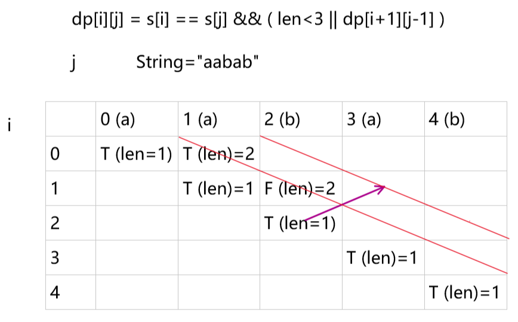

## Remember Normal Framework of Algorithm

### 1. Recursive
* Backtrack
    * Demo:
     ```python
        class Solution:
            def permuteUnique(self, nums: List[int]) -> List[List[int]]:
                res=[]
                def dfs(nums,path):
                    if not nums:
                        res.append(path)
                    else:
                        last='' # use last to remember variable just selected
                        for i in range(len(nums)):
                            if not nums[i]==last: # skip the variable just selected
                                dfs(nums[:i]+nums[i+1:],path+[nums[i]])
                                last=nums[i]

                dfs(sorted(nums),[]) # Deduplication, sorted()
                return res
     ```
    * Scenarios:
        * Problems related to path
        * 

### 2. Dynamic Programming
* __Condition__:
    * Optimal substructure
    * Overlapping sub-problems
* __Implementation__:
    * This can be achieved in either of two ways:
        * __*Top-down approach*__: This is the direct fall-out of the recursive formulation of any problem. If the solution to any problem can be formulated recursively using the solution to its sub-problems, and if its sub-problems are overlapping, then one can easily memoize or store the solutions to the sub-problems in a table. Whenever we attempt to solve a new sub-problem, we first check the table to see if it is already solved. If a solution has been recorded, we can use it directly, otherwise we solve the sub-problem and add its solution to the table.
        * __*Bottom-up approach*__: Once we formulate the solution to a problem recursively as in terms of its sub-problems, we can try reformulating the problem in a bottom-up fashion: try solving the sub-problems first and use their solutions to build-on and arrive at solutions to bigger sub-problems. This is also usually done in a tabular form by iteratively generating solutions to bigger and bigger sub-problems by using the solutions to small sub-problems. For example, if we already know the values of F41 and F40, we can directly calculate the value of F42.
    
* The __*core*__ of dynamic programming: __*recursive formulas (i.e. the transfer of state equations), then fill in the state table*__
    * Therefore, you must know exactly what the state means in the equation, e.g. the meaning of $(i,j)$
    * Dimensionality reduction
* Differences from "divide and conquer":
    * There are two key attributes that a problem must have in order for dynamic programming to be applicable: optimal substructure and overlapping sub-problems. If a problem can be solved by combining optimal solutions to non-overlapping sub-problems, the strategy is called "divide and conquer" instead.[1] This is why merge sort and quick sort are not classified as dynamic programming problems
* __Procedure__:
    * Determine the state
        * The last step (optimal coin combination:(2,5,7)->27, $a_k$)
        * Translate into subproblems (27-$a_k$)
    * State transition equation
        * $F[x]=min\{F[x-2]+1,F[x-5]+1,F[x-7]+1\}$
    * Initial condition and the boundary condition
        * $F[0]=0, the\;F[y]=+Inf$ if it cannot be combined by $y$
        * Note that initialization (i.e. the way to fill in the table) depends on the state transition equation
            * For example, check whether a string is palindrome
            ```java
                boolean[][] dp = new boolean[s.length()][s.length()];
                int length = s.length();
                //考虑所有长度的子串
                for (int len = 1; len <= length; len++) {
                    //从每个下标开始
                    for (int i = 0; i <= s.length() - len; i++) {
                        int j = i + len - 1; // i and j change synchronously
                        dp[i][j] = s.charAt(i) == s.charAt(j) && (len < 3 || dp[i + 1][j - 1]);
                    }
                }

                作者：windliang
                链接：https://leetcode-cn.com/problems/palindrome-partitioning/solution/xiang-xi-tong-su-de-si-lu-fen-xi-duo-jie-fa-by-3-7/
                来源：力扣（LeetCode）
                著作权归作者所有。商业转载请联系作者获得授权，非商业转载请注明出处。
            ```
            
        * 

    * The calculation order:
        * $F[0], F[1], F[2]...$
* __Scenarios__
    * optimal value
    * count problem
    * exist or not
    
* __Summary__:
    * Note the form of the equation when two or more objects are involved, where the equation must contain pointers that can represent each object individually
    * Most recursion can be rewritten with the idea of dynamic programming
* References:
    * https://en.wikipedia.org/wiki/Dynamic_programming


### 3. The theory of Graph

* __BFS__

* __DFS__
    


### 4. Search

### 5. Iteration


### 6. Notice
* Never pursue the complexity of control logic
* On the other hand, simple, efficient and easy to understand is the ultimate goal of coding


### Appendix:
* The **Merge** type:
    * by a group of two
    * divid and conquer

* Linked list operation:
    * Note the head insertion and tail insertion
    * Note the importance of Head Node


* __Sorting__ is sometimes useful

* Note the mechanism of signal variables in control logic

* The characteristics of the Algorithm:
    * An important technique for proving the finiteness and correctness of an algorithm is to look at the entire calculation process from an appropriate perspective and discover some of its __**invariance**__ and __**monotonicity**__.
* __xor__ operator:
    * Carryless addition: 
    ```c
    0 xor 0=0+0=0, 0 xor 1=0+1=1
    0 xor 1=0+1=1, 1 xor 0=1+0=1
    1 xor 0=1+0=1, 1 xor 1=1+1=0
    1 xor 1=1+1=0
    ```

* __Common Error__:
    * Note the return in the recursive function
    * Note the dynamic length of the dynamically changing stack or queue
    * Note that the results are correct if and only if every step in the coding is correct
    
    
    
